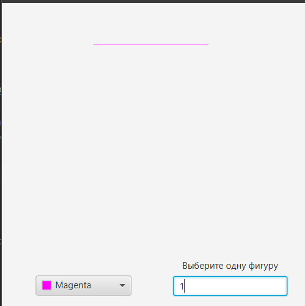
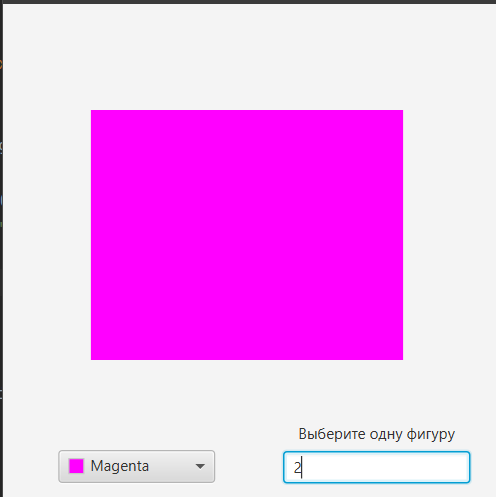
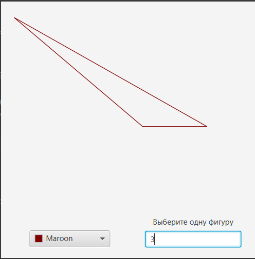
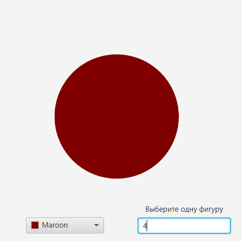

# ПРАКТИЧЕСКАЯ РАБОТА №2.2
## Фабричный метод
вывод линии

вывод прямоугольника

вывод треугольника

вывод круга

## Было реализованно:
- Фабричный метод, который позволяет написовать выбранную фигуру
- Выбор цвета фигуры реализуется через ColorPicer
